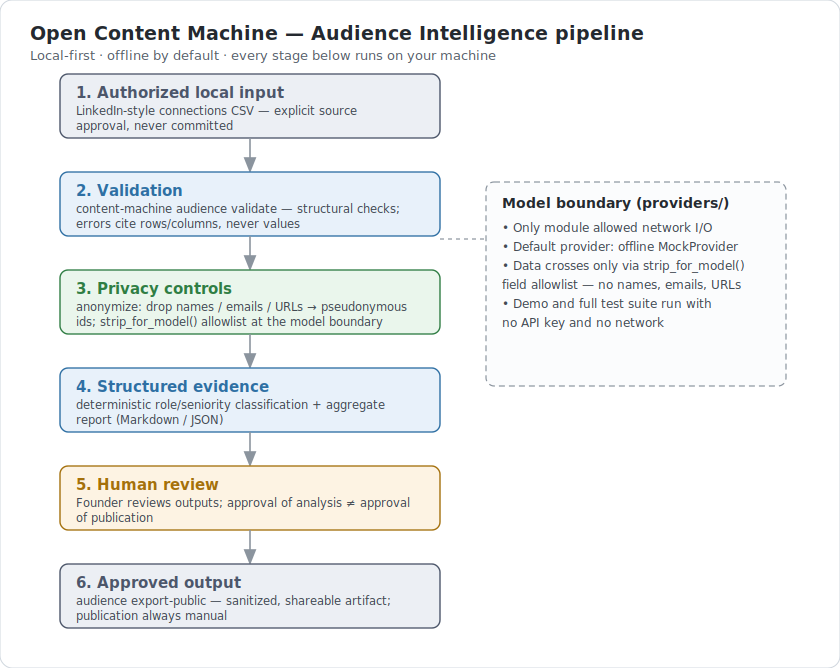
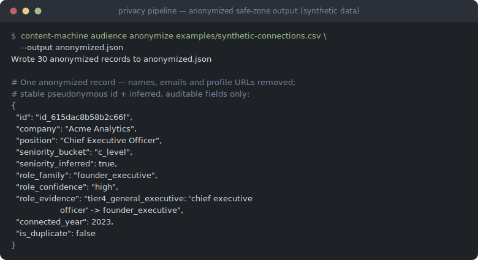
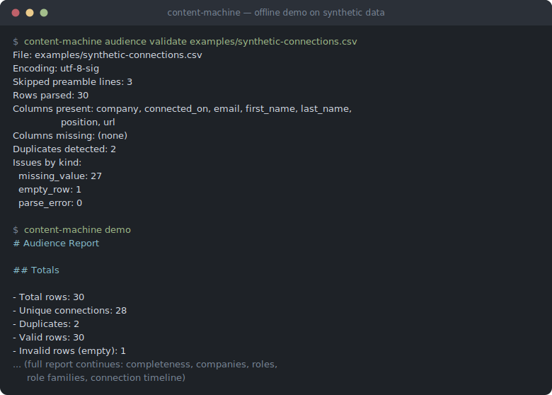

# Open Content Machine

**Open Content Machine** is a local-first, privacy-first system that turns an
authorized professional-network export into audience intelligence —
validated, anonymized, and reported entirely offline, with human approval
gates before anything becomes public.

[](https://github.com/samuel3ssilva/open-content-machine/actions/workflows/ci.yml)
[](LICENSE)
[](pyproject.toml)


**Maturity: Early MVP · active development · portfolio project · not
production-ready.**

## The problem

Creators and professionals hold real context — a professional network,
notes, lived experience — that could become genuinely useful content and
positioning. Today, turning that context into content usually means either
handing personal data to cloud tools, or doing everything by hand. This
project explores a third path: doing it locally, privately, with a human
always in charge of what actually gets published.

## The approach

Deterministic local code is preferred over a model call wherever possible.
Privacy boundaries are enforced in code, not just policy. The model layer is
offline-by-default and isolated behind a single abstraction, and nothing
reaches an audience without an explicit human approval gate.

The current build focus is **Audience Intelligence**: validate, anonymize,
and report over a LinkedIn-style connections export, entirely offline, with
no API key and no personal data ever leaving the machine. Later modules
(positioning, voice, drafting, review, repurposing) follow the same
principles — see [`ROADMAP.md`](ROADMAP.md).

## Try it in 60 seconds

```bash
git clone https://github.com/samuel3ssilva/open-content-machine.git
cd open-content-machine
python -m venv .venv && source .venv/bin/activate
pip install -e ".[dev]"
content-machine demo
```

What this proves: the full validate → anonymize → classify → report pipeline
runs end to end, entirely offline, on synthetic data, with no API key. What
it does **not** prove: anything about real-data behavior or model output
quality — the only provider exercised here is an offline mock.



## What this project demonstrates

- Local-first product architecture
- Privacy-by-design: deterministic anonymization, a field allowlist at the
  model boundary, errors that cite rows/columns and never values
- Python CLI development (Typer)
- Deterministic data pipelines
- Schemas and data contracts (`schemas/`)
- Automated tests and CI — 329 tests; lint, type checks, and an automated
  release security checklist all run in CI
- Model-provider boundary design
- Human approval gates
- Threat modeling and ADRs (`docs/adr/`)
- AI-assisted engineering with documented human review — see
  [`docs/model-routing.md`](docs/model-routing.md)

Read more: [Portfolio case study — the story, decisions, and evidence in one
page](docs/PORTFOLIO_CASE_STUDY.md).

## Table of contents

- [How to read this repo](#how-to-read-this-repo)
- [Privacy principles](#privacy-principles)
- [Status](#status)
- [Install](#install)
- [Quickstart](#quickstart)
- [Architecture at a glance](#architecture-at-a-glance)
- [CLI reference](#cli-reference)
- [Features today vs. roadmap](#features-today-vs-roadmap)
- [Engineering trade-offs](#engineering-trade-offs)
- [Project structure](#project-structure)
- [Model workforce](#model-workforce)
- [Contributing and license](#contributing-and-license)
- [Portfolio case study](docs/PORTFOLIO_CASE_STUDY.md)

## How to read this repo

- **30 seconds:** the top of this README, including the architecture diagram
  above; the two terminal screenshots under [Quickstart](#quickstart) and
  [Privacy principles](#privacy-principles) if you have a few seconds more.
- **2 minutes:** [Architecture at a glance](#architecture-at-a-glance),
  [Privacy principles](#privacy-principles), the key decisions in
  [`docs/adr/`](docs/adr/), and [Engineering trade-offs and
  limitations](#engineering-trade-offs).
- **10 minutes:** [Quickstart](#quickstart), [CLI
  reference](#cli-reference), [`schemas/`](schemas/),
  [`SECURITY.md`](SECURITY.md), [`docs/threat-model.md`](docs/threat-model.md),
  [`CONTRIBUTING.md`](CONTRIBUTING.md), and [`ROADMAP.md`](ROADMAP.md).

## Privacy principles

- No personal data leaves the machine. No cloud infrastructure, no telemetry.
- Direct identifiers (names, emails, profile URLs) are removed, not masked,
  at anonymization — see [`docs/privacy.md`](docs/privacy.md).
- The only network-capable code lives in `providers/`, and it ships only the
  offline `MockProvider` — the vendor stubs contain no network code path.
- Inference is always labeled: a connection's existence is never presented as
  evidence of interest in the creator's content.



Full details: [`SECURITY.md`](SECURITY.md) (guarantees, secret hygiene,
release checklist) and [`docs/privacy.md`](docs/privacy.md) (data
classification and handling rules).

## Status

- **v0.0.1** is tagged; Sprint 1.x additions (`audience inspect --dry-run`,
  deterministic role classification, the expanded private report,
  `audience export-public`, `audience evaluate-review`,
  `audience compare-classifiers`, `source inspect`) are merged on `main` but
  **not yet in a tagged release**.
- Current quality gates (as of 2026-07-23): **329 tests passing**, `ruff`
  clean, `mypy` clean, CI green on GitHub Actions.
- **Real-data status (precise claims):** Under explicit Founder authorization,
  the pipeline has processed one private, real connections export **locally**
  (a metadata-only dry-run, then one real local run; outputs live outside
  this repository). **No real personal data has ever been committed to this
  repository, and the shipped pipeline has never transmitted personal data to
  an external model — the default provider is offline and the vendor provider
  stubs contain no network code path.** All public examples, fixtures, and
  demos use synthetic data. `v0.1.0` will be tagged only after the remaining
  release gates in [`docs/release-gates-v0.1.0.md`](docs/release-gates-v0.1.0.md)
  pass.

Live one-page dashboard: [MVP Status](docs/MVP_STATUS.md). See
[`ROADMAP.md`](ROADMAP.md) for the full build order and
[`CHANGELOG.md`](CHANGELOG.md) for what has landed so far.

## Install

Requires Python 3.12 or later.

```bash
python -m venv .venv && source .venv/bin/activate && pip install -e ".[dev]"
```

## Quickstart

```bash
content-machine --help
content-machine version
content-machine demo

content-machine audience validate <file.csv>
content-machine audience anonymize <file.csv> -o out.json
content-machine audience report <file.csv> [-o report.md] [--json report.json]

# Sprint 1: read-only structural inspection of an external file (no cell
# value, ever — see docs/privacy.md). Always required to pass --dry-run.
content-machine audience inspect <file.csv> --dry-run

# Sprint 1: sanitize a private report.json into a shareable artifact
# (suppresses any group under 10; adds privacy_label="sanitized-aggregate").
content-machine audience export-public <report.json> -o public.json [--md public.md]

# Sprint 1.2: metadata-safe inventory of a private source folder (Phase 1 —
# triage only, no content is read). --output-dir must be OUTSIDE the repo.
content-machine source inspect ~/private/biography-material --dry-run \
  --output-dir ~/private/biography-material/_inventory
```



All commands run fully offline and require no API key. `content-machine demo`
runs the full validate → anonymize → report flow against a synthetic example
CSV so you can see the pipeline without touching any real data. To use your
own export, keep it outside the repository (or in the git-ignored
`data/private/` — see [`data/README.md`](data/README.md)) and point the
commands at its path; nothing is ever copied into the project. Details in
[`docs/private-workspace.md`](docs/private-workspace.md).

### Example: `content-machine demo`

Real output (truncated) from running the offline demo against the shipped
synthetic dataset:

```
# Audience Report

## Totals

- Total rows: 30
- Unique connections: 28
- Duplicates: 2
- Valid rows: 30
- Invalid rows (empty): 1

## Data completeness

| Column | Complete |
| --- | --- |
| company | 96.7% |
| connected_on | 100.0% |
...
```

(The one empty row is tracked separately from the 30 data rows, which is why
`valid + invalid` does not sum to the total above.)

## Architecture at a glance

```
data/private/ (git-ignored, never committed)
        │
        ▼  TB-1: read-only, never copied
   Connections.csv
        │
        ▼
   [ validate ]  → row/column issues, no values
        │
        ▼
   [ normalize ] → whitespace, company suffixes, seniority, year
        │
        ▼  TB-2: names / emails / URLs REMOVED here
   [ anonymize ] → HMAC-SHA256 pseudonym id
        │
        ▼
   [ classify ]  → deterministic role-family + confidence
        │
        ▼
   [ aggregate ] → counts, distributions, candidate segments
        │
        ├──▶ report.md / report.json      (private; may have small groups)
        └──▶ export-public → public.json  (TB-3: groups <10 suppressed)
```

Full trust-boundary details: [`docs/architecture.md`](docs/architecture.md).

## CLI reference

One line each, taken conservatively from each command's `--help` text:

| Command | What it does |
| --- | --- |
| `content-machine version` | Print the installed version. |
| `content-machine demo` | Run the full report pipeline on the shipped synthetic example (stdout). |
| `content-machine audience validate <file.csv>` | Validate a CSV and print a quality summary. Exit 1 if unreadable. |
| `content-machine audience anonymize <file.csv> [-o out.json]` | Anonymize a CSV and write the safe-zone JSON list. |
| `content-machine audience report <file.csv> [-o report.md] [--json report.json]` | Run the full pipeline and render a Markdown (+ optional JSON) report. |
| `content-machine audience inspect <file.csv> --dry-run` | Privacy-safe, read-only inspection of an external CSV (dry-run only). |
| `content-machine audience export-public <report.json> -o out.json [--md out.md]` | Sanitize a private report JSON into a shareable public artifact. |
| `content-machine audience evaluate-review <review.csv>` | Aggregate a private Founder review CSV and print AGGREGATES ONLY. |
| `content-machine audience compare-classifiers <fixture.csv> --baseline <snapshot.json>` | Classify a fixture with the CURRENT code and diff it against a baseline. |
| `content-machine source inspect <folder> --dry-run --output-dir <dir>` | Phase-1 metadata-safe inventory of a private source folder (dry-run only). |

## Features today vs. roadmap

**Implemented today (`main`):**

- `content-machine --help` / `version` / `demo`
- `content-machine audience validate FILE`
- `content-machine audience anonymize FILE -o OUT.json`
- `content-machine audience report FILE [-o OUT.md] [--json OUT.json]`
- `content-machine audience inspect FILE --dry-run` — privacy-safe structural
  inspection of an external file; never prints a cell value, makes no network
  calls, never copies the source
- `content-machine audience export-public REPORT.json -o OUT.json [--md OUT.md]`
  — sanitizes a private report into a shareable artifact (suppresses groups
  under 10)
- `content-machine audience evaluate-review REVIEW.csv` — aggregates a
  private Founder review CSV and prints aggregates only, never a title
- `content-machine audience compare-classifiers FIXTURE.csv --baseline SNAPSHOT.json`
  — classifies a public fixture with the current code and diffs it against a
  baseline snapshot
- `content-machine source inspect FOLDER --dry-run --output-dir DIR` —
  metadata-safe inventory of a private source folder (Phase 1: file bodies
  are never read); writes three private outputs (Markdown, JSON, review CSV)
  whose approval fields start empty — see
  [`docs/source-approval-gate.md`](docs/source-approval-gate.md)
- Deterministic, explainable role-family classification
  (`content_machine/audience/classify.py`): a seven-tier precedence engine
  with independent family (function) and seniority (level) inference, broad
  PT/EN vocabulary coverage, an explicit confidence level per title, and an
  evaluation harness (`audience/evaluate.py`) that scores it against a
  labeled synthetic fixture — see [`docs/classification.md`](docs/classification.md)
- Localized (Portuguese/Spanish) header and connection-date aliases
- Expanded private report: role/seniority/confidence distributions,
  candidate segments, mandatory limitations

**Planned:** positioning & creator profile, voice vault, oracle, interview
panel, draft-in-voice, evidence check, writer's council, revision,
repurpose, analytics — see the full build order in
[`ROADMAP.md`](ROADMAP.md).

## Engineering trade-offs

- Role and seniority classification are keyword-table heuristics, not ML —
  explainable and auditable, but will miss or misclassify titles outside the
  tables (always shipped with an explicit confidence level, never presented
  as ground truth).
- Fully offline by design: no network I/O anywhere in this release, including
  the two model-provider stubs (`providers/anthropic_provider.py`,
  `providers/openai_provider.py`).
- Flat-file storage only (CSV in, JSON/Markdown out) — no database; fine for
  a single export, not built for large-scale longitudinal history.
- Single-user, single-machine execution model; no multi-tenant or server
  deployment story.
- The public-export suppression threshold (k=10) is a fixed constant, not a
  configurable privacy budget.

### Limitations

- Single-module MVP: only Audience Intelligence is implemented in code.
- Vendor providers (`providers/anthropic_provider.py`,
  `providers/openai_provider.py`) are stubs — no network code path exists in
  this release, even with a key configured.
- Content and positioning phases (positioning, voice, drafting, review,
  repurpose, etc.) are roadmap items, not shipped code — see
  [`ROADMAP.md`](ROADMAP.md).
- Classification is heuristic and deterministic (keyword tables), not ML,
  and is English/Portuguese-focused.
- Not production-ready: no auth, no multi-tenant story, no database, no
  deployment story.
- Solo-founder project, AI-assisted engineering — scope and pace reflect
  that.

## Project structure

```
src/content_machine/
├── config/      # typed settings: paths, salt, provider choice
├── ingestion/   # reading external exports (CSV) safely
├── privacy/     # PII detection/stripping, deterministic pseudonymization
├── audience/    # normalization, statistics, report generation
├── providers/   # ModelProvider interface + offline Mock (Anthropic/OpenAI are inert stubs)
└── cli/         # Typer app: `content-machine` and its subcommands

docs/            # architecture, privacy, threat model, ADRs, vision
schemas/         # public JSON Schemas for data contracts
examples/        # synthetic example data and expected outputs
data/private/    # your real, git-ignored local data (never committed)
```

See [`docs/architecture.md`](docs/architecture.md) for the full module map,
trust boundaries, and dependency rules.

## Model workforce

The Founder directs this project and owns every product, privacy, and
publication decision. The Claude models are a supervised engineering
workforce under a documented routing policy, with a fixed division of labor:
**Fable** handles architecture and security, **Opus** handles engineering
design, and **Sonnet** handles implementation. See
[`docs/model-routing.md`](docs/model-routing.md) for the full routing rules
and accountability model.

## Contributing and license

See [`CONTRIBUTING.md`](CONTRIBUTING.md) for dev setup, quality gates, and
privacy rules for contributors, and [`CODE_OF_CONDUCT.md`](CODE_OF_CONDUCT.md)
for community expectations. Licensed under [Apache-2.0](LICENSE).

## Em português

O Open Content Machine é uma plataforma open-source, local-first e
privacy-first que transforma a rede profissional, as notas e as experiências
de um criador em inteligência de audiência, posicionamento e conteúdo na voz
do próprio criador. Tudo roda na máquina do criador: nenhum dado pessoal sai
do computador, código determinístico local é sempre preferido a chamadas de
modelo, e o único módulo capaz de acessar a rede é o `providers/` — que
expõe apenas um provider simulado (`MockProvider`), totalmente offline.

O primeiro módulo em construção é o de Inteligência de Audiência: validar,
anonimizar e gerar relatórios a partir de uma exportação de conexões no
estilo LinkedIn, sem exigir chave de API e sem que nenhum dado pessoal saia
da máquina. A Sprint 1 adicionou uma inspeção estrutural somente-leitura
(`audience inspect --dry-run`) e uma classificação determinística de papéis
profissionais (`audience/classify.py`), ambas já em `main`, mas ainda sem uma
release marcada. Os módulos seguintes (posicionamento, voz, rascunhos,
revisão, repropósito de conteúdo) seguem o mesmo roteiro em
[`ROADMAP.md`](ROADMAP.md). Consulte [`docs/privacy.md`](docs/privacy.md) e
[`SECURITY.md`](SECURITY.md) para os detalhes de privacidade e segurança.
